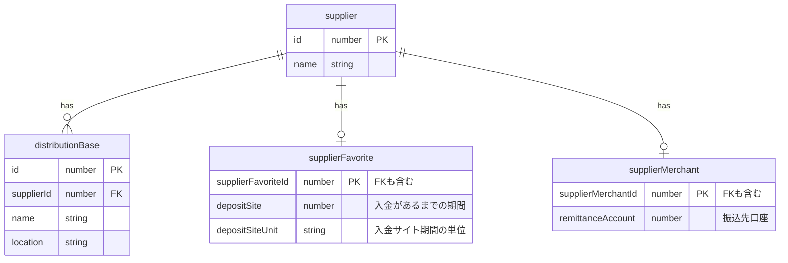

個々の取引先が持つ場合と持たない場合がある属性を、ほかの派生テーブルに切りだす。

```mermaid
erDiagram
%% 取引先のサブタイプの管理主体

%% 共用データ管理システム
supplier{
	id number PK
	name string
}

distributionBase{
	id number PK
	supplierId number FK
	name string
	location string
}

%% 事業データ管理システム
supplierFavorite {
	supplierFavoriteId number PK "FKも含む"
	depositSite number "入金があるまでの期間"
	depositSiteUnit string "入金サイト期間の単位"
}

%% 財務データ管理システム
supplierMerchant {
	supplierMerchantId number PK "FKも含む"
	remittanceAccount number "振込先口座"
}

supplier ||--o{ distributionBase: has
supplier ||--o| supplierFavorite : has
supplier ||--o| supplierMerchant : has
```
