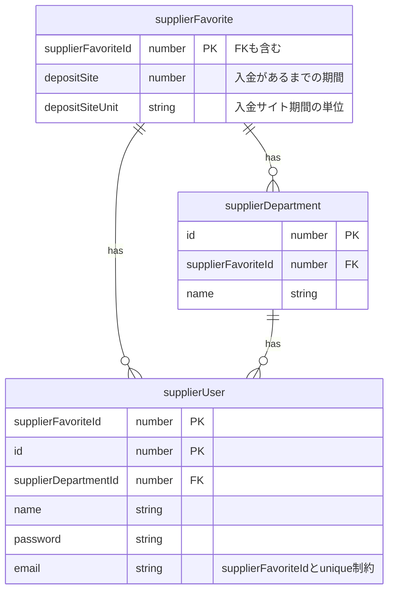

得意先属性の延長として、サービス契約企業に所属するユーザーや部門を含めて管理刷ることがある。

```mermaid

erDiagram

supplierFavorite {
	supplierFavoriteId number PK "FKも含む"
	depositSite number "入金があるまでの期間"
	depositSiteUnit string "入金サイト期間の単位"
}


supplierDepartment {
	id number PK
	supplierFavoriteId number FK
	name string
}

supplierUser {
	supplierFavoriteId number PK
	id number PK
	supplierDepartmentId number FK
	name string
	password string
	email string "supplierFavoriteIdとunique制約"
}

supplierFavorite ||--o{ supplierDepartment: has
supplierFavorite ||--o{ supplierUser: has
supplierDepartment ||--o{ supplierUser: has
```
