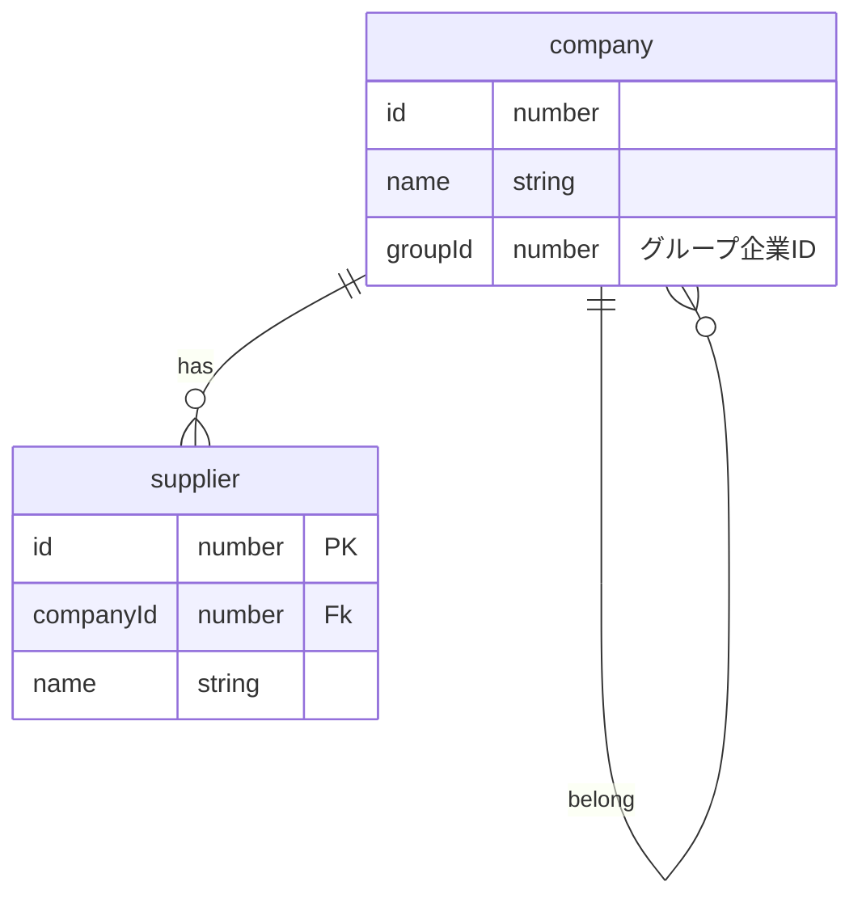

```mermaid
erDiagram
%% 企業と取引先のモデル
company{
	id number
	name string
	groupId number "グループ企業ID"
}

supplier{
	id number PK
	companyId number Fk
	name string
}

company ||--o{ supplier : has
company ||--O{ company : belong
```
