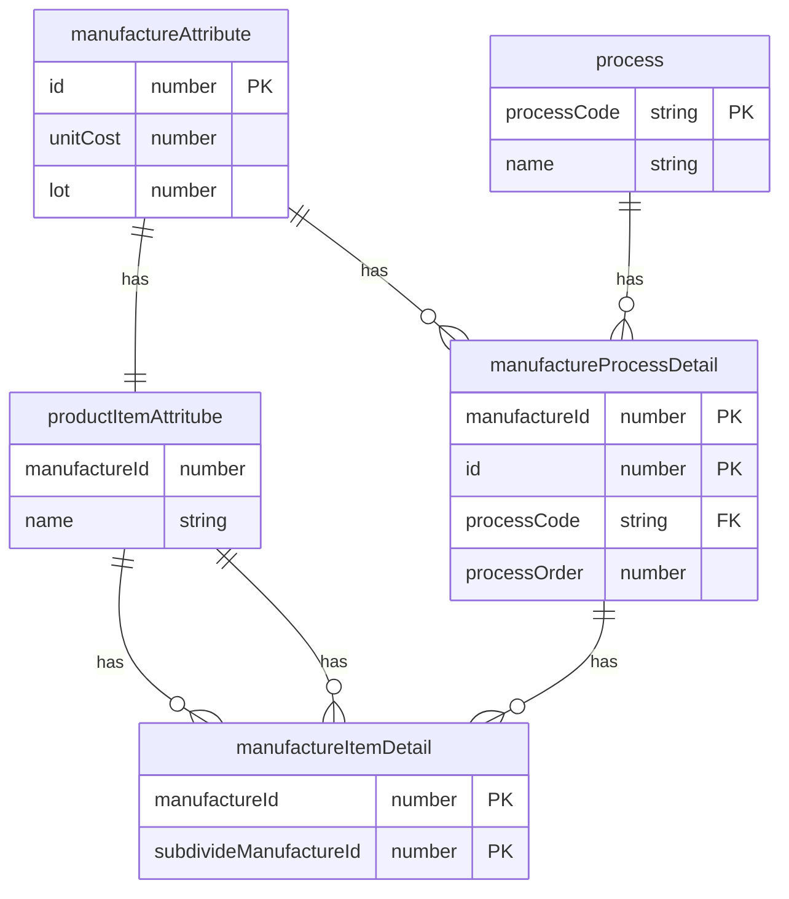

```mermaid
erDiagram

manufactureAttribute{
	id number PK
	unitCost number
	lot number
}

process{
	processCode string PK
	name string
}

manufactureProcessDetail{
	manufactureId number PK
	id number PK
	processCode string FK
	processOrder number
}

manufactureItemDetail{
	manufactureId number PK
	subdivideManufactureId number PK
}

productItemAttritube{
	manufactureId number
	name string
}

manufactureAttribute ||--|| productItemAttritube :has
manufactureAttribute ||--o{ manufactureProcessDetail:has
process ||--o{ manufactureProcessDetail:has
manufactureProcessDetail ||--o{ manufactureItemDetail:has

productItemAttritube ||--o{ manufactureItemDetail:has
productItemAttritube ||--o{ manufactureItemDetail:has
```
