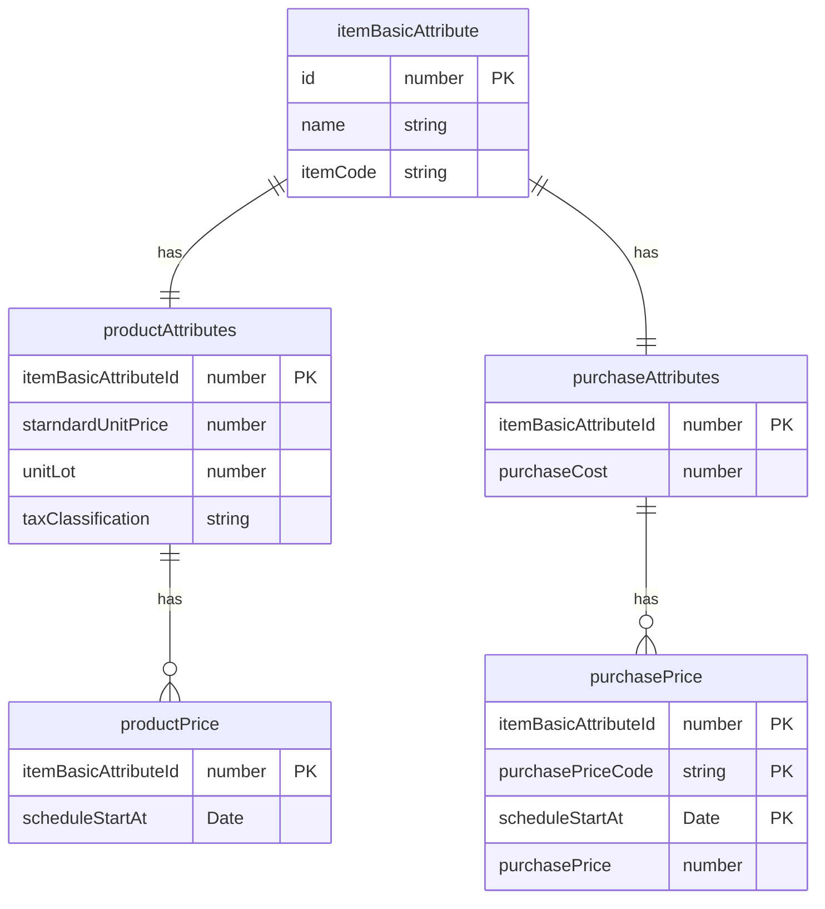

```mermaid
erDiagram

itemBasicAttribute{
	id number PK
	name string
	itemCode string
}

	productAttributes{
	itemBasicAttributeId number PK
	starndardUnitPrice number
	unitLot number
	taxClassification string
}

productPrice{
	itemBasicAttributeId number PK
	scheduleStartAt Date
}

purchaseAttributes{
	itemBasicAttributeId number PK
	purchaseCost number
}

purchasePrice{
	itemBasicAttributeId number PK
	purchasePriceCode string PK
	scheduleStartAt Date PK
	purchasePrice number
}

itemBasicAttribute ||--|| productAttributes :has
productAttributes ||--o{ productPrice :has

itemBasicAttribute ||--|| purchaseAttributes:has
purchaseAttributes ||--o{ purchasePrice:has
```
