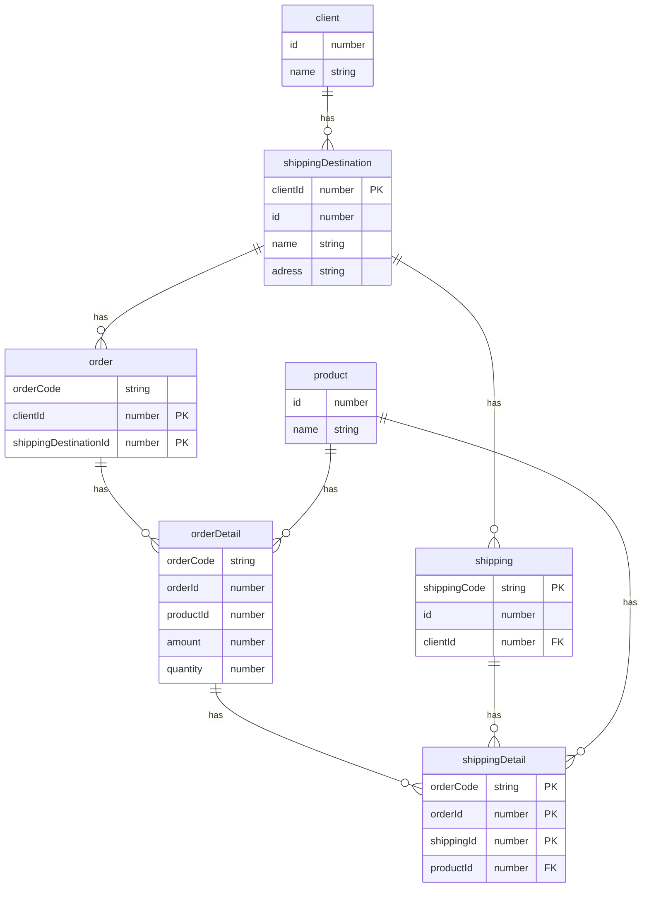

```mermaid
erDiagram

client{
	id number
	name string
}

shippingDestination{
	clientId number PK
	id number
	name string
	adress string
}

order{
	orderCode string
	clientId number PK
	shippingDestinationId number PK
}

orderDetail{
	orderCode string
	orderId number
	productId number
	amount number
	quantity number
}

shippingDetail {
	orderCode string PK
	orderId number PK
	shippingId number PK
	productId number FK
}

shipping{
	shippingCode string PK
	id number
	clientId number FK
}

product{
	id number
	name string
}

client ||--o{ shippingDestination:has
shippingDestination ||--o{ shipping :has
shippingDestination ||--o{ order:has

order ||--o{ orderDetail :has
orderDetail ||--o{ shippingDetail :has
shipping ||--o{ shippingDetail:has

product ||--o{ orderDetail :has
product ||--o{ shippingDetail:has
```
