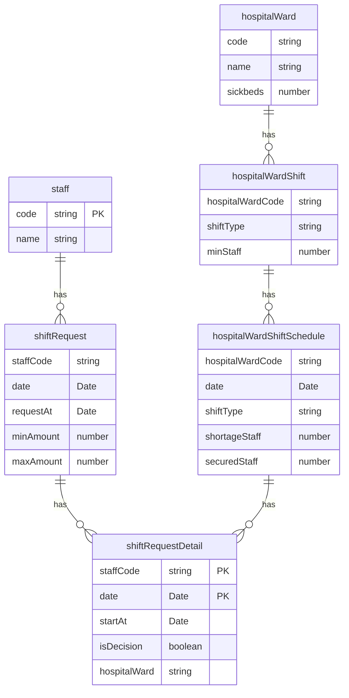

```mermaid
erDiagram

staff{
	code string PK
	name string
}

shiftRequest{
	staffCode string
	date Date
	requestAt Date
	minAmount number
	maxAmount number
}

shiftRequestDetail{
	staffCode string PK
	date Date PK
	startAt Date
	isDecision boolean
	hospitalWard string
}

hospitalWardShiftSchedule{
	hospitalWardCode string
	date Date
	shiftType string
  shortageStaff number
	securedStaff number
}

hospitalWardShift{
	hospitalWardCode string
	shiftType string
	minStaff number
}

hospitalWard{
	code string
	name string
	sickbeds number
}

staff ||--o{ shiftRequest:has

shiftRequest ||--o{ shiftRequestDetail:has
hospitalWardShiftSchedule ||--o{ shiftRequestDetail:has

hospitalWard ||--o{ hospitalWardShift:has
hospitalWardShift ||--o{ hospitalWardShiftSchedule :has
```
