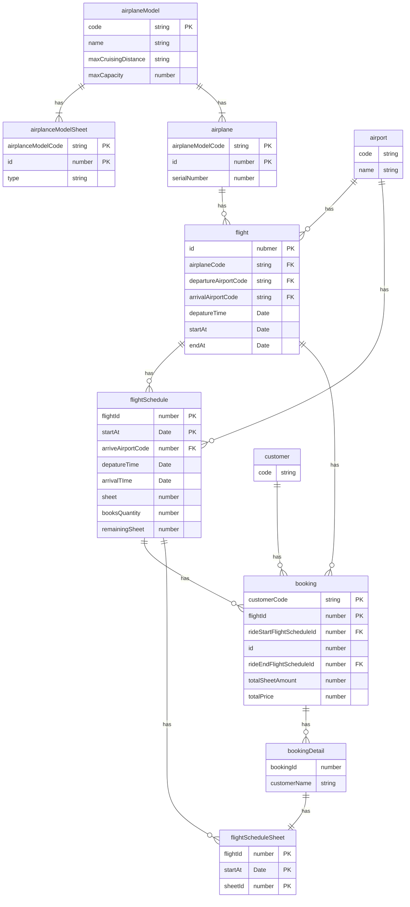

```mermaid
erDiagram

airplaneModel{
	code string PK
	name string
	maxCruisingDistance string
	maxCapacity number
}

airplanceModelSheet{
	airplanceModelCode string PK
	id number PK
	type string
}

airplane{
	airplaneModelCode string PK
	id number PK
	serialNumber number
}

flight{
	id nubmer PK
	airplaneCode string FK
	departureAirportCode string FK
	arrivalAirportCode string FK
	depatureTime Date
	startAt Date
	endAt	Date
}

flightSchedule{
	flightId number PK
	startAt Date PK
	arriveAirportCode number FK
	depatureTime Date
	arrivalTIme Date
	sheet number
	booksQuantity number
	remainingSheet number
}

flightScheduleSheet{
  flightId number PK
	startAt Date PK
	sheetId number PK
}

booking{
	customerCode string PK
	flightId number PK
	rideStartFlightScheduleId number FK
	id number
	rideEndFlightScheduleId number FK
	totalSheetAmount number
	totalPrice number
}

bookingDetail{
	bookingId number
	customerName string
}

customer{
	code string
}

airport{
	code string
	name string
}

airplaneModel ||--|{ airplanceModelSheet:has
airplaneModel ||--|{ airplane :has

airplane ||--o{ flight:has
airport ||--o{ flight:has

airport ||--o{ flightSchedule:has
flight ||--o{ flightSchedule :has
flight ||--o{ booking :has

customer ||--o{ booking:has
flightSchedule ||--o{ booking:has

flightSchedule ||--o{ flightScheduleSheet:has
bookingDetail ||--|| flightScheduleSheet:has


booking ||--o{ bookingDetail:has
```
