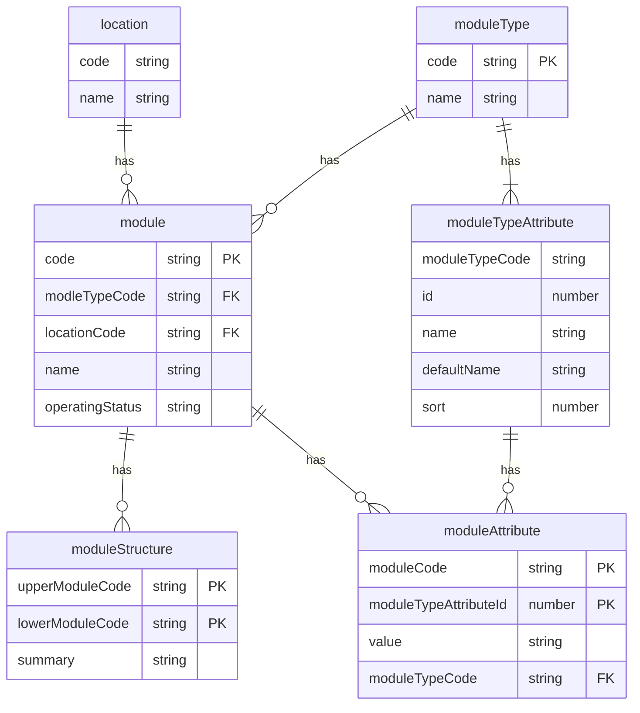

```mermaid
  erDiagram

location{
	code string
	name string
}

module{
	code string PK
	modleTypeCode string FK
	locationCode string FK
	name string
	operatingStatus string
}

moduleStructure{
	upperModuleCode string PK
  lowerModuleCode string PK
	summary string
}

moduleAttribute{
	moduleCode string PK
	moduleTypeAttributeId number PK
	value string
	moduleTypeCode string FK
}

moduleTypeAttribute{
	moduleTypeCode string
	id number
	name string
	defaultName string
	sort number
}

moduleType{
	code string PK
	name string
}

location ||--o{ module:has
moduleType ||--o{ module:has
moduleType ||--|{ moduleTypeAttribute :has

module ||--o{ moduleStructure :has
module ||--o{ moduleAttribute :has
moduleTypeAttribute ||--o{ moduleAttribute:has
```
