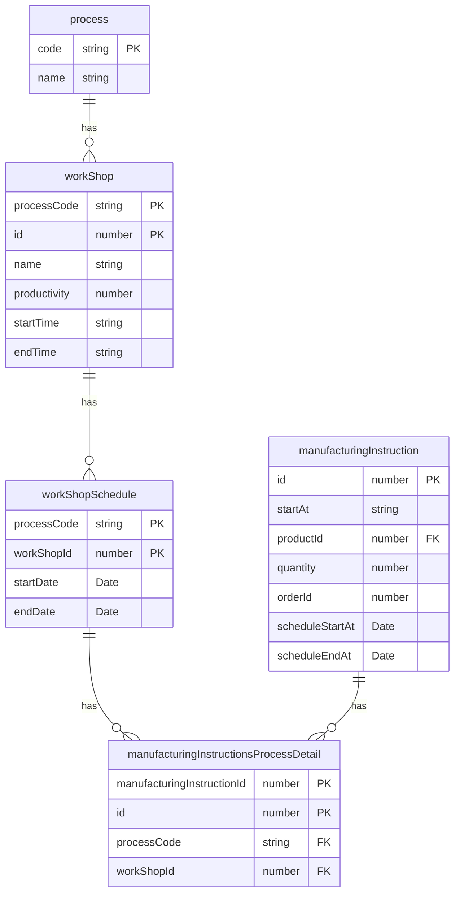

```mermaid
erDiagram

process{
	code string PK
	name string
}

workShop{
	processCode string PK
	id number  PK
	name string
  productivity number
	startTime string
	endTime string
}

workShopSchedule{
	processCode string PK
	workShopId number PK
	startDate Date
	endDate Date
}

manufacturingInstructionsProcessDetail{
  manufacturingInstructionId number PK
	id number PK
  processCode string FK
	workShopId number FK
}

manufacturingInstruction{
	id number PK
	startAt string
	productId number FK
	quantity number
	orderId number
	scheduleStartAt Date
  scheduleEndAt Date
}

process ||--o{ workShop :has

workShop ||--o{ workShopSchedule:has

workShopSchedule ||--o{ manufacturingInstructionsProcessDetail:has
manufacturingInstruction ||--o{ manufacturingInstructionsProcessDetail:has
```
